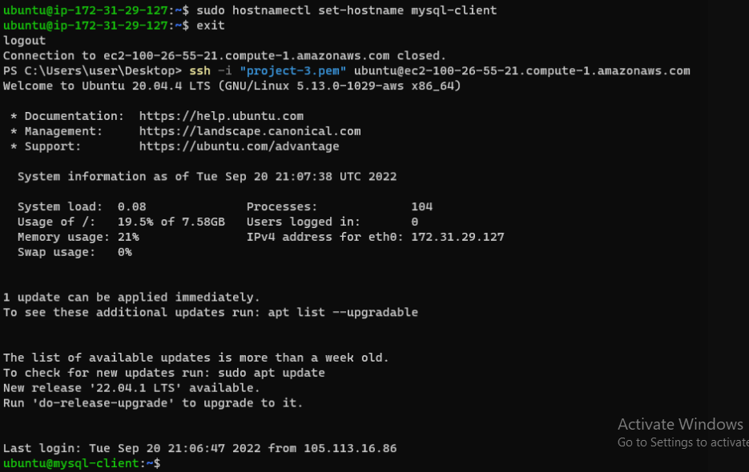

# PECTOR DOCUMENTATION FOR PROJECT 5
- Two instances were created, one for the client and the other for the server.
- 
First, a updated and upgraded `sudo apt update` and `sudo apt upgrade`, then install mysql server  with `sudo apt install mysql-server -y`,  For the mysql-client server, I ran `sudo hostnamectl set-hostname mysql-client`

- I lated opt into mysql, create password, create user, create database, grant all on test db, flush priviledges then EXIT

- To allow my connection I ran `sudo vi /etc/mysql/mysql.conf.d/mysqld.cnf` and edit my inbound rule for the mysql server to port3306

Thank you and God bless.